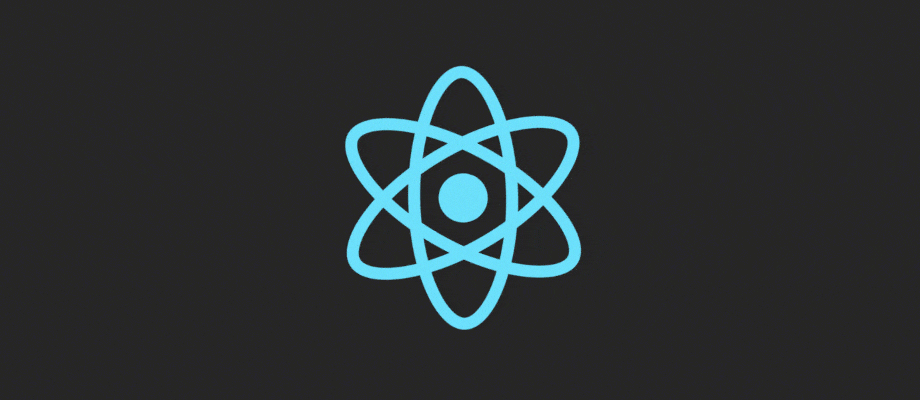

<!--  -->
<!--  -->

<h1 align="center">Meet Mohit Joshi! 🌟</h1>
<h3 align="center">Creative Front-End Developer Crafting Engaging User Experiences</h3>
<!--  -->

 

- 🔭 I’m currently working on **Flutter Blog Application**
- 🌱 I’m currently learning **Flutter and Docker**
- 👨‍💻 All of my projects are available at [**iammohit.in**](https://iammohit.in/)
- 💬 Ask me about **NextJs and NodeJS**
- 📫 How to reach me **withmohitjoshi@gmail.com**
- 📄 Know about my experiences and achievements [**here**](https://iammohit.in/static/media/Mohit-Resume.7ed47b6fee1371ac420a.pdf)
- ⚡ Fun fact **I'm not sure how but I will**

 

<h3 align="left">Connect with me:</h3>

    

<h3 align="left">Languages and Tools:</h3>

 

  

<!-- 

 -->

<!-- 
&nbsp;&nbsp;&nbsp;
 -->
